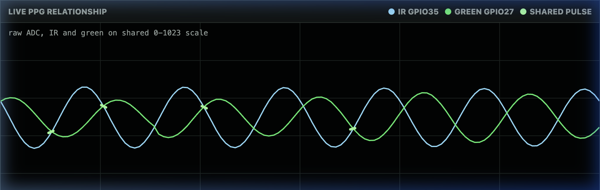
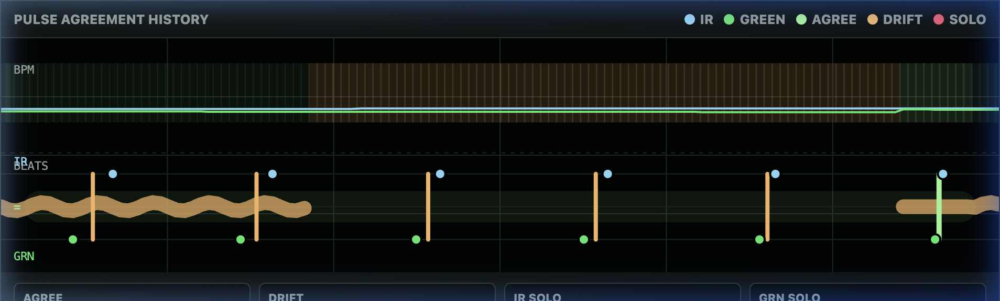
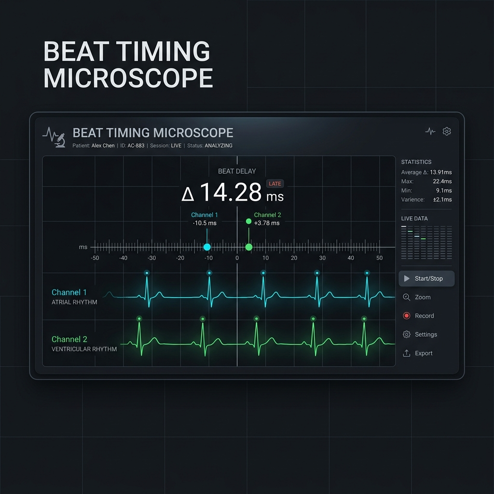

# PulseSensor WebSerial Interactive Dashboard & Learning Tool

This repository contains the standalone, single-page interactive HTML and JavaScript client that connects to microcontrollers (like ESP32 or Arduino) via the Web Serial API. It visualizes and teaches real-time Photoplethysmography (PPG) signal behavior, heart rate calculation (BPM), and multi-channel synchronization.

This project is linked directly to the official tutorial page: [pulsesensor.com/pages/pulsesensor-and-webserial](https://pulsesensor.com/pages/pulsesensor-and-webserial).

---

## 🎨 Interface Gallery

### 1. Live Waveform Analysis (Comparator Dashboard)
The primary layout features real-time PPG waveform overlays, comparing Channel A (cyan) and Channel B (green) raw signals alongside calculated beats-per-minute (BPM) and inter-beat intervals (IBI).



### 2. A/B Beat Timing Ladder (Infographic Chart)
The timing ladder evaluates heart beat event alignment across channels. It displays synchronization state, drift, and solo beats (potential false positives).



### 3. Beat Timing Microscope
A high-resolution diagnostic panel displaying sub-millisecond delays between the detectors.



---

## 🚀 Key Features

*   **Zero-Install USB Telemetry:** Uses the browser-native Web Serial API (available in Chrome, Edge, and Brave) to open a raw USB serial port and plot data in real time.
*   **Dual PPG Overlap Comparator:** Plots raw ADC sensor waveforms (light blue for Channel A / GPIO35, light green for Channel B / GPIO27) on a shared 0–1023 scale.
*   **A/B Beat Ladder (Timing Infographic):** A visual state-machine representation showing how individual beats align. It draws green rungs when beats agree, orange rungs during timing drift, and red markers for solo/false-positive beat events.
*   **Beat Timing Microscope:** Magnifies the timing difference (inter-beat interval, or IBI) between the two sensors on a shared center scale (±120ms) to inspect minor timing variations.
*   **Private Correlation Pad:** Tracks the Green-to-IR amplitude ratio trend over time and allows manual session markers (`REST`, `HOLD`, `MOVE`, `NOTE`).
*   **Interactive Demo Mode:** An offline simulation that generates realistic dual-PPG waveforms, locks the signals, introduces drift segments, and triggers false positives to showcase all state changes without physical hardware.

---

## 📊 Telemetry Data Format

The JavaScript engine reads lines from the serial port at `115200` baud. It filters for telemetry lines starting with the header `AB,` and splits them into a 22-value CSV schema:

```
AB,t,aSample,aBpm,aIbi,aQuality,aBeats,aAmp,aRange,aLocked,aBeat,bSample,bBpm,bIbi,bQuality,bBeats,bAmp,bRange,bLocked,bBeat,bpmDiff,winner
```

### Schema Field Map:
| Column | Name | Type | Description |
|---|---|---|---|
| 0 | `header` | string | Constant identifier `AB` |
| 1 | `t` | integer | Timestamp in milliseconds since boot |
| 2 | `aSample` | integer | Channel A raw ADC reading (0–1023) |
| 3 | `aBpm` | integer | Channel A calculated Beats Per Minute |
| 4 | `aIbi` | integer | Channel A Inter-Beat Interval in ms |
| 5 | `aQuality` | integer | Channel A signal quality confidence (0–100%) |
| 6 | `aBeats` | integer | Channel A total qualified beat count |
| 7 | `aAmp` | integer | Channel A peak-to-peak amplitude |
| 8 | `aRange` | integer | Channel A live min-max signal range |
| 9 | `aLocked` | 0 or 1 | Channel A sensor status (1 = locked/tracking, 0 = searching) |
| 10 | `aBeat` | 0 or 1 | Channel A instantaneous beat state (1 = in beat) |
| 11–19 | (same) | (same) | Channel B fields corresponding to columns 2–10 |
| 20 | `bpmDiff` | integer | Absolute difference between both calculated heart rates |
| 21 | `winner` | string | Lead channel name (`IR`, `GRN`, or `EVEN`) |

---

## 🛠️ Repository Context & Future AI Development

> [!NOTE]
> **To Future AI Assistants and Developers:**
> You are continuing development on the interactive Web Serial client. This repository serves as its permanent development memory.
> Please follow the guidelines below to maintain design continuity and expand utility.

### Guidelines for Future Development:
1.  **Maintain Single-File Portability:** Keep the main dashboard client in [webserial.html](webserial.html) / [index.html](index.html) self-contained (HTML, CSS, and JS all in one file). This allows users to double-click and run it offline, and simplifies uploading to Shopify pages.
2.  **Premium CSS Styling:** Maintain modern, high-fidelity dark-mode aesthetics (using CSS variables, rich palettes, clean borders, and responsive grid layouts). Keep typography legible (preferring system-ui fonts) and avoid generic element states.
3.  **Local Testing:** Use python's HTTP server to test the interface locally:
    ```bash
    python3 -m http.server 8765
    ```
    Then load: `http://localhost:8765/index.html`.
4.  **Publishing Workflow:** 
    *   Development takes place here: `github.com/yury-g/webserial`
    *   When stable, publication is released to: `github.com/WorldFamousElectronics` (either as a new repository or embedded in `PulseSensor_CYD`).

---

## 📅 UI Changelog & Evolution History

*   **2026-05-22 15:00 EDT**
    *   **Timestamped Code Comments:** Annotated all core layout blocks and canvas render routines directly within the HTML/JS source code (`webserial.html` / `index.html`).
    *   **Interface Gallery Release:** Embedded high-fidelity visual diagrams (raw comparator waveforms, A/B beat timing ladder, and delta-IBI microscope) into the `README.md`.
*   **2026-05-19 14:54 EDT**
    *   **Telemetry Event Logging:** Introduced manual session markers (`REST`, `HOLD`, `MOVE`, `NOTE`) and custom ratio inputs plotting directly to the G/IR pad.
*   **2026-05-19 14:04 EDT**
    *   **A/B Beat Ladder:** Replaced standard timing charts with an A/B beat ladder infographic showing color-coded event connections (agree, drift, solo).
*   **2026-05-19 13:19 EDT**
    *   **Microscope Widget:** Added the sub-millisecond magnified delta-IBI timing microscope to track micro-variations.
*   **2026-05-19 13:04 EDT**
    *   **Shared Raw Waveforms:** Merged separate sensor plots into a single, shared-scale (0-1023) dual-channel comparator chart.

